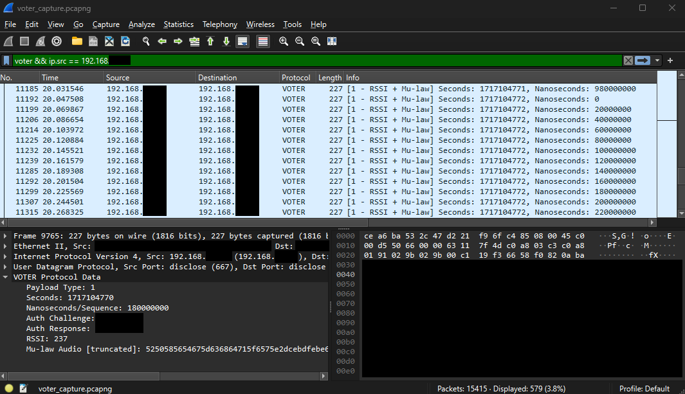

# VOTER Protocol Dissector for Wireshark

This Lua script (`voter.lua`) acts as a dissector for the VOTER protocol in Wireshark, allowing for advanced VOTER packet interpretations from network traffic captures.

The VOTER Protocol, which stands for Voice Observing Time Extension (for) Radio, was created by Jim Dixon, WB6NIL (SK). It is used for the transmission of audio signals from remote radio receivers along with ultra-precise (GPS-based) timing information and signal quality.



## Created by

Mason Nelson, N5LSN/WRKF394

## Features

- Dissects VOTER protocol packets and displays relevant fields in Wireshark.
- Supports various payload types, including:
  - Authentication plus flags
  - RSSI information and Mu-law audio
  - GPS information
  - RSSI information and ADPCM audio
  - Ping (connectivity test)
- Populates the Info column in Wireshark with a detailed description based on the payload type.

## How to Use

### Requirements

- Wireshark with Lua support enabled.

### Installation

1. Place the `voter.lua` file inside the Personal Lua Plugins directory.
   - `Help -> About Wireshark -> Folders -> Personal Lua Plugins`
2. Restart Wireshark

### Usage

1. **Open Wireshark**.
2. **Capture or open a capture file** that contains VOTER protocol traffic.
3. **Wireshark will automatically** use the `voter.lua` dissector for packets on UDP port 667.

### Info Column Format

The Info column in Wireshark will be populated with detailed information based on the payload type of the VOTER protocol packet. The format is as follows:

- **Payload type 0**: `[0 - Auth + Flags] Seconds: {seconds}, Nanoseconds: {nanoseconds}`
- **Payload type 1**: `[1 - RSSI + Mu-law] Seconds: {seconds}, Nanoseconds: {nanoseconds}`
- **Payload type 2**: `[2 - GPS] Seconds: {seconds}, Nanoseconds: {nanoseconds}`
- **Payload type 3**: `[3 - RSSI + ADPCM] Seconds: {seconds}, Nanoseconds: {nanoseconds}`
- **Payload type 4**: `[4 - RESERVED] Seconds: {seconds}, Nanoseconds: {nanoseconds}`
- **Payload type 5**: `[5 - PING] Seconds: {seconds}, Nanoseconds: {nanoseconds}`

### Example Output

When a VOTER protocol packet is captured and dissected, the Info column might show:
```
[1 - RSSI + Mu-law] Seconds: 1622519071, Nanoseconds: 500000000
```