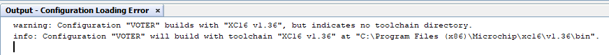
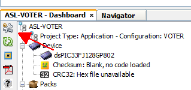
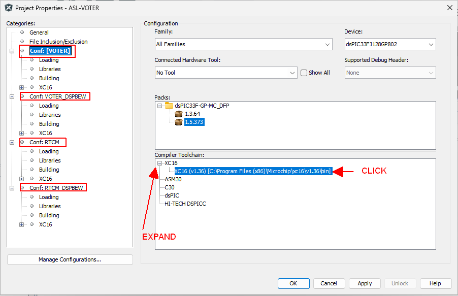
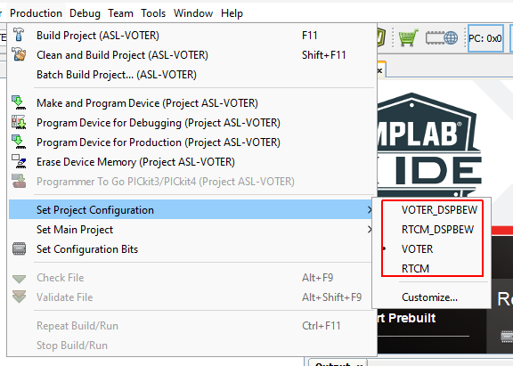

# How-to (Re-)Compile Firmware for the VOTER/RTCM Boards
If you look in the [votersystem.pdf](https://github.com/AllStarLink/Voter/blob/mplabx/docs/votersystem.pdf), you will find a procedure to modify and load the bootloader in to the PIC of a VOTER/RTCM board. 

As of firmware version 4.00, this is no longer relevant (and it also was missing steps).

The current procedure for compiling the firmware uses the Microchip MPLAB X IDE, and the Microchip XC16 compiler.

## Download Required MPLAB Tools
Currently (September 2026), you can get the required software from:

[https://www.microchip.com/en-us/tools-resources/archives/mplab-ecosystem](https://www.microchip.com/en-us/tools-resources/archives/mplab-ecosystem)

Download [MPLAB X IDE 64-bit Windows v5.50](https://www.microchip.com/en-us/tools-resources/archives/mplab-ecosystem#MPLAB%20X%20IDE%20Archives):

* [https://ww1.microchip.com/downloads/en/DeviceDoc/MPLABX-v5.50-windows-installer.exe](https://ww1.microchip.com/downloads/en/DeviceDoc/MPLABX-v5.50-windows-installer.exe)

Download [MPLAB XC Compiler v1.36b (WIN) (1/25/19)](https://www.microchip.com/en-us/tools-resources/archives/mplab-ecosystem#xc16):

* [https://ww1.microchip.com/downloads/en/DeviceDoc/xc16-v1.36b-full-install-windows-installer.exe](https://ww1.microchip.com/downloads/en/DeviceDoc/xc16-v1.36b-full-install-windows-installer.exe)

## Install MPLAB Tools
The Microchip tools will install and run on Windows 10/11. You **can** install the tools in Windows Sandbox, if you don't want to install them permanently on your system (just remember that closing the Sandbox window will require you to re-install from scratch next time).

### Install the MPLAB IDE

* Run the MPLAB IDE installer

* Uncheck the anonymous statistics reporting

* Uncheck all the device support except 16-bit (that's our target)

* Accept the rest of the defaults

* Uncheck the boxes on the last screen to prevent opening un-necessary links to other software tools

### Install the XC16 Compiler

* Run the MPLAB C Compiler installer

* Install Free mode

* Check the box to add XC16 to the PATH

## Optional - Install Free Compiler License

Suppress compiler warnings about *"options have been disabled due to restricted license"* by downloading and installing a legacy license from [https://www.microchip.com/en-us/tools-resources/develop/mplab-xc-compilers/xc16](https://www.microchip.com/en-us/tools-resources/develop/mplab-xc-compilers/xc16) by selecting: "Access Legacy Compiler License"

You will need to create a Microchip account to get it.

Download the zip, extract, run the .bat file.

## Get the Source

Go to:

* [https://github.com/AllStarLink/Voter](https://github.com/AllStarLink/Voter)
* Ensure you are on the **"Master"** branch (unless you specifically want a different branch)
* From the green Code dropdown button, select "Download Zip"

That will get you `voter-master.zip` which is a download of the whole VOTER tree from GitHub. Extract it somewhere that you can find.

## (Re-)Compiling the Firmware

To compile the firmware (if you want to make custom changes)...

1) Launch the MPLAB X IDE
2) Go to File --> Open Project --> navigate to the `VOTER_RTCM-firmware --> build-files` folder in the source archive, and click on the `ASL-VOTER.X` folder, then the Open Project button
3) Observe the *"warning: Configuration "VOTER" builds with "XC16 v1.36", but indicates no toolchain directory."* warning in the output box:

    * Click on the Project Properties button:
        * 
    * From the new window that opens:
        * 
        * Click on the Conf: header for the project configuration in the Categories pane on the left
        * Expand the XC16 tree in the Compiler Toolchain
        * Click on the XC16 path (that should be existing, since you installed the XC16 compiler)
        * Repeat the same steps for the rest of the Conf: targets
        * Click Ok
    * This is an MPLAB X bug that doesn't store the toolchain path in the project files correctly when they are distributed
4) Pick the type of firmware you wish to compile
    * Go to Production --> Set Project Configuration
        * 
    * Pick the firmware configuration you want to build (VOTER or RTCM, DSPBEW or Normal)
5) Go to Production --> Clean and Build Project
    * This will build the firmware configuration selected
    * Ignore the warning for *"src/TCPIP_Stack/ENC28J60.c:115:0: warning: "SR" redefined"*
    * Ignore the warnings about *"PA-W0010 Warning: Resource version (1.05) does not match!"*
    * If you did not install the optional free compiler license, also ignore the warnings about *"options have been disabled due to restricted license"*
    * At the end of the output window, you should see: *"BUILD SUCCESSFUL (total time: 17s)"* in green. If you see "*BUILD FAILED*", STOP!
    * Scroll back up in the log and check for any other compiler warnings or errors
6) Change the project configuration (as shown above) and build any other firmware as desired
7) Output files will be located in the ASL-VOTER.X folder
    * `.cry` files are for use with the EBLEX C30 Ethernet Loader
    * `.hex` files should typically be ignored (you CAN use them with an EEPROM programmer, but they will overwrite the bootloader)

**NOTE:** Remember that the VOTER and the RTCM use different processors. Be sure to pick the correct project configuration to build that matches your hardware!

That's it!

Now you should be able to modify at-will. :)

## Baseband Examination Window (BEW) Firmware

Typically, the discriminator of an FM communications receiver produces results containing audio spectrum from the "sub-audible" range (typically < 100 Hz) to well above frequencies able to be produced by modulating audio. These higher frequencies can be utilized to determine signal quality, since they can only contain noise (or no noise, if a sufficiently strong signal is present).

For receivers (such as the Motorola Quantar, etc.) that do not provide sufficient spectral content at these "noise" frequencies (for various reasons), The "DSP/BEW (Digital Signal Processor / Baseband Examination Window)" feature of the VOTER/RTCM firmware may be utilized.

These receivers are perfectly capable of providing a valid "noise" signal with no modulation on the input of the receiver, but with strong modulation (high frequency audio and high deviation), it severely interferes with proper analysis of signal strength.

This feature provides a means by which a "window" of baseband (~300-3500Hz) signal is examined by a DSP to see if there is currently audio (speech or tones) present, which could "contaminate" a signal strength measurement. If the baseband is quiet, a signal strength sample is allowed to take place. When there IS audio or tones present in the baseband, the signal strength value is "held" (the last valid value previous to the time of interference) until such time that the interfering audio is no longer present.

Note that this feature does **not** measure signal strength in the baseband... it still uses the normal high-pass (9kHz) filter circuit to take the noise measurement from the discriminator. However, when the baseband is *quiet*, that typically leaves enough noise to measure more accurately, even if the attached radio doesn't have great high-frequency discriminator response. 

The DSP/BEW feature is selectable, and should not be used for a receiver that does not need it.

***If you compile/load firmware in the VOTER/RTCM with BEW features, you will LOSE the Diagnostics Menu, as there isn't enough room in the dsPIC for both!***

Firmware compiled with the `BEW` option will indicate such in the version at the top of the console screen on the device.
